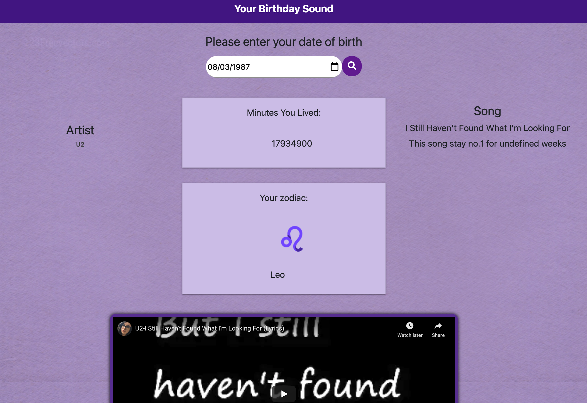

# group_2_api

Project Name: "Your Birthday Sound"

### Description:

A tool that receives inputted data from user on when they were born (month, day , year), and returning a report on what song was top of the Billboard charts that day.
Parsing different objects from Billboard API, Youtube Search API and Giphy API, Your Birthday Sound will be a fun activity for users to learn about their past and life through song and data.

deployed link: https://ptlillis.github.io/group_2_api/

Final Design:

### Mockup:

(assets/Screen Shot 2020-12-15 at 8.37.21 PM.png)

### Team Members:
Zaid A: CSS, HTML, JS
Mishel B: CSS, HTML, wireframing, API research
Arjun G: JS, API research, ajax
Peter L: repo management, API research, ajax, HTML wireframing, CSS

